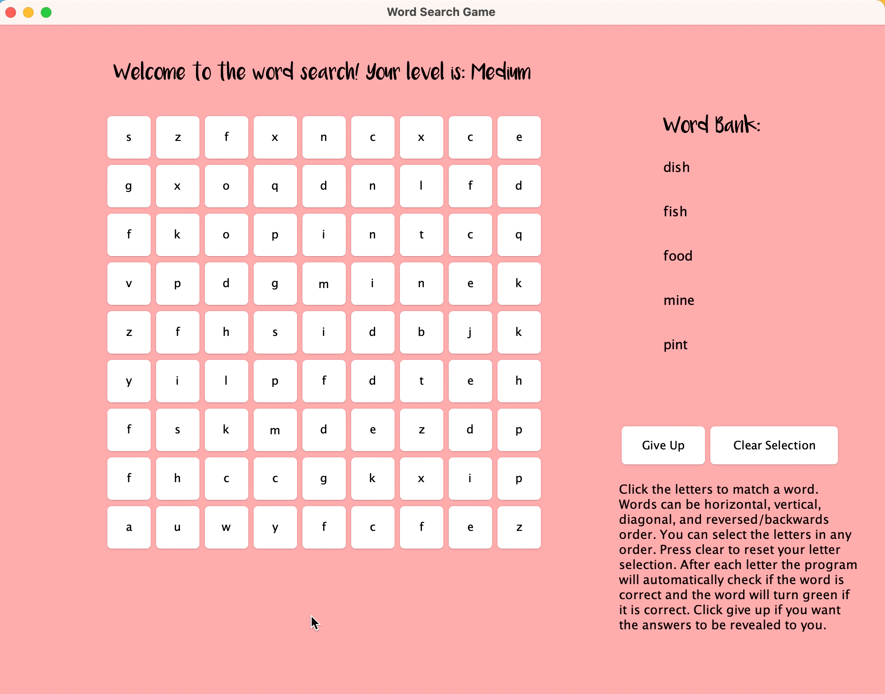

# Java Word-Search

Developed a multi-level GUI word search with Java Widgets and routing to three levels and a user guide, utilizing principles such as searching algorithms, OOP, and reading from external files.

 ## Demo 

Playing easy level:

Winning easy level: 

Clearing user selection and medium level:

Giving up for answers and difficult level:

User guide and quit:

